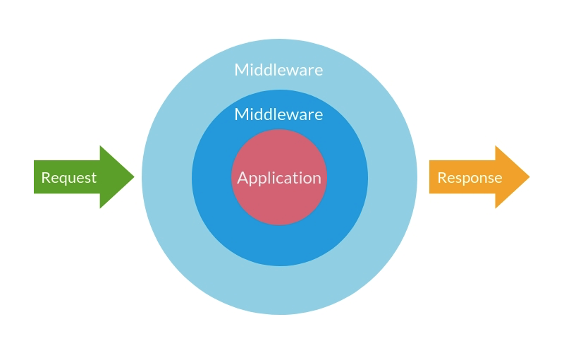

### Middleware

A middleware can transform the input or the outout of a handler. He can also if he wishes to interrupt his execution by raising an exception

To define a set of middleware whose execon order is defined, there exists the notion of middlewares chain.

It is possible to name a middleware chain for reuse.

In case a query / command does not have a specific middleware execution chain, it will use the string whose name is 'global'. if it does not exist then no middleware will be added to the execution

A middleware can for example,
- logger input and output of a handler
- profile the execution time, the CPU time, the amount of memory used
- cache an answer to save resources and time
- validate an input
- and all that could be useful to do

### What is a middleware ?



#### How to register middleware

```yaml
services:
     YourMiddlewareClass:
         tags:
             - { name: nihilus.cqrs.[command|query]_middleware, identifier: short_name }
```

#### How to add middleware to chain

```yaml
nihilus_cqrs:
    query|command:
        middleware:
            main_chain: ['transaction']
            chain_name: ['@main_chain', 'another_middleware']
```

##### Tips

By default, all query/command use `global` chain name

#### How to add specific middleware to one query/command

```yaml
nihilus_cqrs:
    query|command:
        middleware:
            main_chain: ['transaction']
            chain_name: ['@main_chain', 'another_middleware']
        binding:
            QueryFQCN/CommandFQCN: ['@main_chain', 'yet_another_middleware']
```